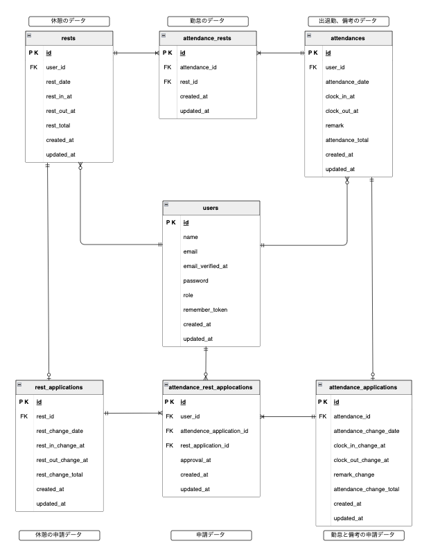

# 勤怠管理アプリ

## テストアカウント
-----------------------------------------------------------------------------------------------
#### ※管理者 及び スタッフの機能を確認して頂く際は、一度ログアウトしてからログインして頂きますようお願いします。
#### ※マルチブラウザで管理者とスタッフが同時にログインできないようになっています。
-----------------------------------------------------------------------------------------------
### ◽️スタッフログイン: http://localhost/login

   > email: reina.n@coachtech.com
   > 
   > password: password123

### ◽️ユーザー登録　: http://localhost/register

### ◽️管理者ログイン: http://localhost/admin/login

   > email: admin@example.com
   > 
   > password: password123


## 環境構築
**◽️Dockerビルド**

```
git clone git@github.com:sumire8007/Attendance-management-app-3-.git
```
```
docker-compose up -d --build
```

**◽️Laravel環境構築**

1.　PHPコンテナにアクセス
```
docker-compose exec php bash
```
2.　composerをインストール
```
composer install
```
3. .env.exampleファイルから、envを作成し、環境変数を変更 (下記に変更)
```
cp .env.example .env
```
【.envファイル 変更箇所】
```
DB_CONNECTION=mysql
DB_HOST=mysql
DB_PORT=3306
DB_DATABASE=laravel_db
DB_USERNAME=laravel_user
DB_PASSWORD=laravel_pass
   ```
4.　KEYを与える
  ```
  php artisan key:generate
  ```
5.　PHPコンテナから抜ける
   ```exit```

**◽️MySQL、laravel_dbでの権限を与えるために下記を実行**
1. MySQLコンテナにアクセス
   ```
   docker-compose exec mysql bash
   ```
2. MySQLにログイン　　※パスワードは、docker-compose.ymlに記載
   ```
   mysql -u root -p
   ```           
5. ユーザーに権限を付与
   ```
   GRANT ALL PRIVILEGES ON laravel_db.* TO 'laravel_user'@'%';
   ```
  
4. 権限を反映
   ```
   FLUSH PRIVILEGES;
   ```
  
5. MySQLコンテナから抜ける
   ```exit;```
   
**◽️テーブルの作成(マイグレーション)**
```
php artisan migrate
```

**◽️ダミーデータの作成(勤怠は2025年1月〜5月分までのデータが作られます)**
```
php artisan db:seed
```
※((もし立ち上げ後、ログイン画面などを表示する際、パーミッションエラーが出た場合は下記コマンドを入力してください。))
```
chmod -R 777 storage bootstrap/cache
```

## PHPUnitテストの実行
1. MySQLコンテナにアクセス後、MySQLにログイン ※パスワードは、docker-compose.ymlに記載
   ```
   docker-compose exec mysql bash
   mysql -u root -p
   ```
2. データベース(demo_test)の作成 
   ```
   CREATE DATABASE demo_test;
   SHOW DATABASES;
   ```
    ※データベース(demo_test)が作成されていることが確認出来ればOK。
 
3. demo_testでの権限を与えるために下記を実行
       
    ユーザーに権限を付与
      ```
      GRANT ALL PRIVILEGES ON demo_test.* TO 'root'@'%';
      ```
  
4. 権限を反映
   ```
   FLUSH PRIVILEGES;
   ```

5. MySQLコンテナから抜ける
   ```exit;```

   
6. テスト用の.envファイル作成
   ```
   docker-compose exec php bash
   cp .env .env.testing
   ```
  
7. .env.testingの環境変数を変更
   ```
   APP_ENV=test
   APP_KEY=

   DB_DATABASE=demo_test
   DB_USERNAME=root
   DB_PASSWORD=root
   ```
8. KEYを与える
   ```
   php artisan key:generate --env=testing
   ```
9. キャッシュの削除
   ```
   php artisan config:clear
   ```
10. テスト用のテーブル作成
   ```
   php artisan migrate --env=testing
   ```
11. テストの実行
  ```
   vendor/bin/phpunit --testdox
  ```

   
   
## 使用技術
• PHP 7.4.9

• Laravel 8.83.8

• MySQL 8.0.26


## URL

・開発環境 ： http://localhost/login

・ phpMyAdmin : http://localhost:8080/

・ MailHog : http://localhost:8025


## ER図


